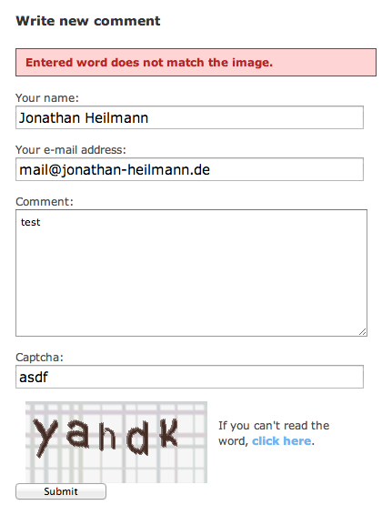

.. ==================================================
.. FOR YOUR INFORMATION
.. --------------------------------------------------
.. -*- coding: utf-8 -*- with BOM.

.. include:: ../Includes.txt

.. _introduction:

.. _introduction_what-does-it-do:

What does it do?
================

This extension adds a captcha to the pwComments comment-form to prevent from spam and/or bot-comments. Actually the captcha extension “sr\_freecap” is supported.

.. _introduction_screenshots:

Screenshots
-----------

	PwComments with sr\_freecap

.. _introduction_contribute:

Contribute
----------
If you found a bug or have a question feel free to open an issue in github: https://github.com/jonathanheilmann/ext-jh_pwcomments_captcha

